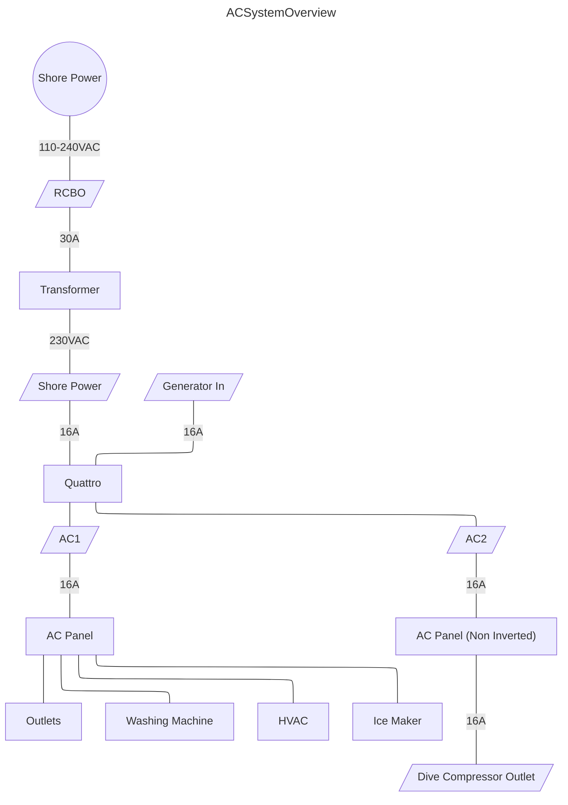

## AC

The AC system is wired to European standard 230VAC/50Hz 16A. The shore power inlet is a NEMA 230VAC/16A receptacle. There is a 30A RCBO Type C breaker directly behind the inlet inside the transom locker. The RCBO protects from both over current and residual current (ground) faults.

### Isolation Transformer
After the RCBO, a Victron auto isolation transformer senses AC line voltage and either passes through 230VAC or converts from 110VAC to 240VAC automatically.  It also can compensate during mild brownouts by raising voltage slightly. The transformer is bonded to shore power ground.

Since the NEMA 230VAC receptacle is identical to the NEMA 120VAC, shore power can be plugged into a US 120VAC 30A supply using a common 30A shore power cable. This is not compliant with ABYC or Euro RCD standards but does work in practice. Note that the transformer does not alter frequency.  European supplies will be at 50Hz and US supplies at 60Hz. All current equipment is capable of using either frequency but be careful when adding new equipment.

### Quattro
Following the transformer, another 20A RCBO located in the DIN rail protects downstream cable and equipment. The Victron Quattro automatically senses AC input line voltage and transfers between shore power (when available), generator, or inverter power. It's operating mode including charge and inverter on/off can be controlled via the Cerbo touch screen at the navdesk. 

The Quattro is software configured to use maximum 15A of shore power at 230VAC and thus restrict shore power to maximum 30A at 110VAC. If the inverter is on, it will use the batteries to assist if loads go over that amount, otherwise it will disconnect all AC loads for 60 seconds then automatically reconnect.

The inverter is configured in AES energy saving mode. If inverter load is very light, it will turn on and off every few seconds. The AC breaker panel leds will blink. The inverter can be controlled via the Cerbo Touch display.

### AC Distribution Panel
The Quattro provides two AC outputs, AC1 and AC2. AC1 is powered by either shore or inverter power. AC2 is only active when connected to shore power (or a generator). All AC device circuits are connected to AC1 except an empty circuit reserved for a dive compressor other high current appliance. Both AC1 and AC2 have additional RCBO protection in the DIN rail.

A BEP millennium AC distribution panel provides AC mains breaker, reverse polarity indicator, and 12 breakers for device circuits. A key to breaker fuse ratings and labels is in the appendices.
### Outlets
All outlets are Type D three prong with on/off switches in each receptacle, the standard in RSA. They are over and residual current fault protected at the DIN rail. There is a residual current tester located in the starboard lounge locker.
### Generator
Harmony originally came fitted with a generator, a Fischer Panda 5000i PMS 4kW diesel unit. It was removed to save weight and maintenance. The mounting location in the port engine room and AC generator circuit were left intact to make it easy to refit if required.

