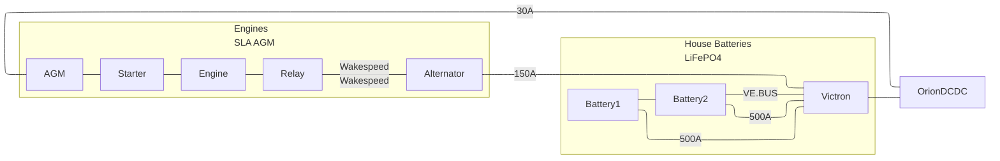

## Batteries

  
Harmony has 2 power buses each with different battery chemistries.
### House Batteries
The main house batteries are 2x 6500Wh LiFEPO4 packs connected in parallel.  They were manufactured by BlueNova. Each pack has an internal BMS, high current disconnect, and a 500A fuse. Each pack has 8x Winston LiFeYPO4 cells wired in 2P4S. They use active top balancing to monitor and maintain internal cells.

Each pack can operate independently but coordinate via CAN if connected. When two packs are connected, one acts as the primary BMS. The BMS connects to the Victron system via VE.BUS CAN bus using the RV-C protocol. The BMS controls target charge voltage and currents. Victron is configured to use the BMS as a DVCC source.

| Specifications |   |
|---|---|
| Manufacturer | Blue Nova ^[https://www.bluenova.co.za/contact-us/]   |
| Model | BN13V-160-6K | 
| Voltage | 12V |
| Size | 6kWh |
| Qty | 2 |
| Fuse | 500A |
| Network | CAN 250kbps |
| Purchased | 8/1/2017 |

### Engine Start Batteries
The engines each have a separate AGM (LA) battery. The alternators charge the LiFePO4 batteries directly and are isolated from the engine  batteries (common ground, isolated V+). A relay powers the charge regulator from the LiFePO4 batteries when the engine is on. Victron Orion DCDC chargers charge the engine start batteries. The 2 buses must be kept separate.
