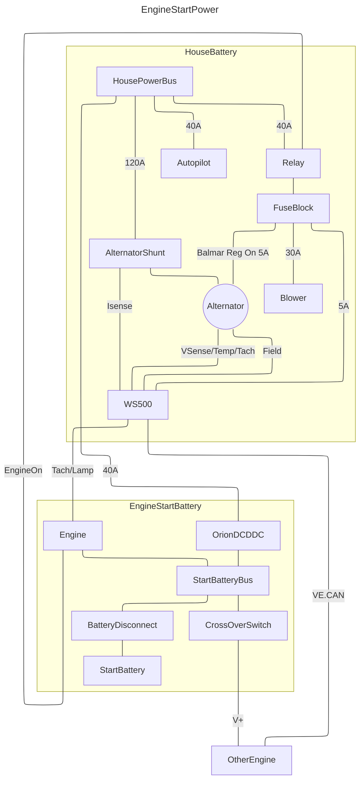

## Engine Start & Charge
### Start Batteries
Both engines have a dedicated 100Ah AGM (SLA) start battery connected to a start bus via a disconnect switch. They are each charged by a dedicated Victron Orion DCDC charger supplied from the house batteries (LiFePO4). There is an emergency cross over switch located in the port engine room that enables starting one engine from the other's battery.

The Victron Orion DCDC chargers can be monitored and configured via Bluetooth using the Victron Connect mobile app. They are not connected to the Victron network (Cerbo).  

There is a spare OEM starter in the aft cabin underneath the outboard bench.
### Alternators
Both alternators are P-Type Balmar 6 Series 120A with K10 serpentine belts. They are connected to the house bus via a shunt and a 150A MRBF fuse. They are each regulated by an external Wakespeed WS500 regulator. In case of a WS500 failure, the internal Balmar regulator can be engaged by moving an ATC fuse from the WS500 to "Internal Regulator" positions. 

The alternator positive is isolated from the engine positive. On startup, the engine run circuit engages a relay with powers the WS500 regulators. It is important to keep the engine circuits (SLA) separate from the alternator circuits (LiFePO4).

