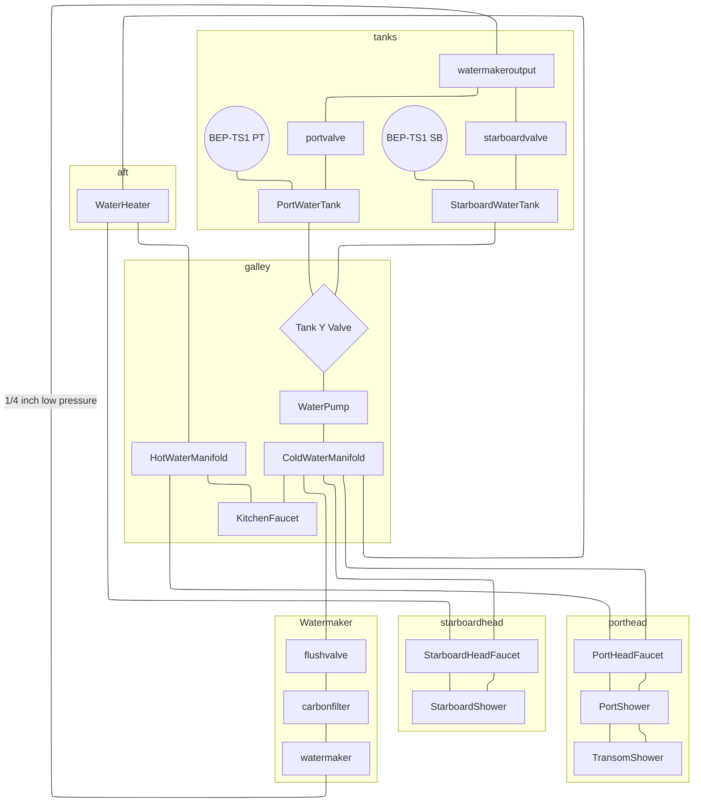

## Fresh Water
### Overview

There are 2x built in water tanks located beneath the mast compression post. They are approximately 400l/100gal each. Piping is a mix of 15mm PEX-AL-PEX and standard 15mm PEX tubing with John Guest push fittings. A tank selector valve is located behind the settee beneath the mast. A "T" mark is embossed on the red handle. The base of the T points to the desired tank or Up for both tanks and Down for off (closed).

### Water Pump
Water pump is a Johnson Aqua Jet Flow Master WPS 5.0 12V with 1/2" BSP fittings. There's a spare in the starboard aft cabin.
### Water Heater
IsoTemp 50l water heater is located in front of the starboard engine. It heats via an engine heat exchanger as well as 230VAC. 
### Water Maker
A Spectra Catalina 300 14gph water maker with an MPC-5000 remote control is located in the port bow.  Product water is sent to either or both water tanks via valves located above the tanks. Make sure at least one of the valves is open while producing water. The MPC unit automates the pre-flush/production/post-flush run cycle and is set to auto flush every 48 hours. Spare filters and parts are located beneath the bench just aft of the watermaker compartment.
#### Commissioning
The watermaker is currently pickled. To recommission:
1. Attach new 1" hose from the strainer to the prefilter unit mounted on the wall
2. Attach new 1" hose from clark pump waste water outlet to the seacock located toward the bow
3. Change the 4 filters (charcoal, 50u, 20u, 5u)
4. Open the sea water inlet seacock located in the locker beneath the watermaker
5. Open the fresh water inlet valve located beneath the pre filter unit
6. Follow the Spectra manual for flushing and commissioning
#### Operation
1. Press run button on panel until desired number of hours appears. Unit will automatically make water and flush.
2. If you press stop, unit will not auto flush. Make sure to press the flush button.
#### Maintenance
1. Flush with fresh water every 2-3 days 
2. Change charcoal filter every 6 months
3. Change sediment filters as needed