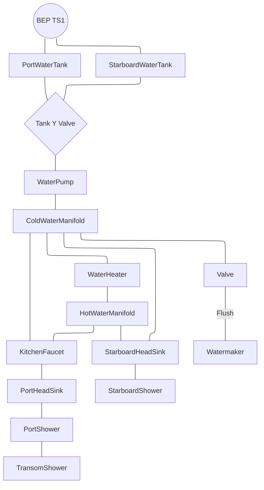

## Fresh Water
### Overview

There are 2x built in water tanks located beneath the mast compression post. They are approximately 400l/100gal each. Piping is a mix of 15mm PEX-AL-PEX and standard 15mm PEX tubing with push fittings. Water pump is a Johnson Aqua Jet Flow Master WPS 5.0 12V with 1/2" BSP fittings. There's a spare in the starboard aft cabin.

### Water Heater
IsoTemp 50l water heater is located in front of the starboard engine. It heats via an engine heat exchanger as well as 230VAC. 
### Water Maker
A Spectra Catalina 300 14gph water maker with an MPC-5000 remote control is located in the port bow.  Product water is sent to either or both water tanks via valves located above the tanks. Make sure at least one of the valves is open while producing water. The MPC unit automates the pre-flush/production/post-flush run cycle and is set to auto flush every 48 hours. Spare filters and parts are located beneath the bench just aft of the watermaker compartment.