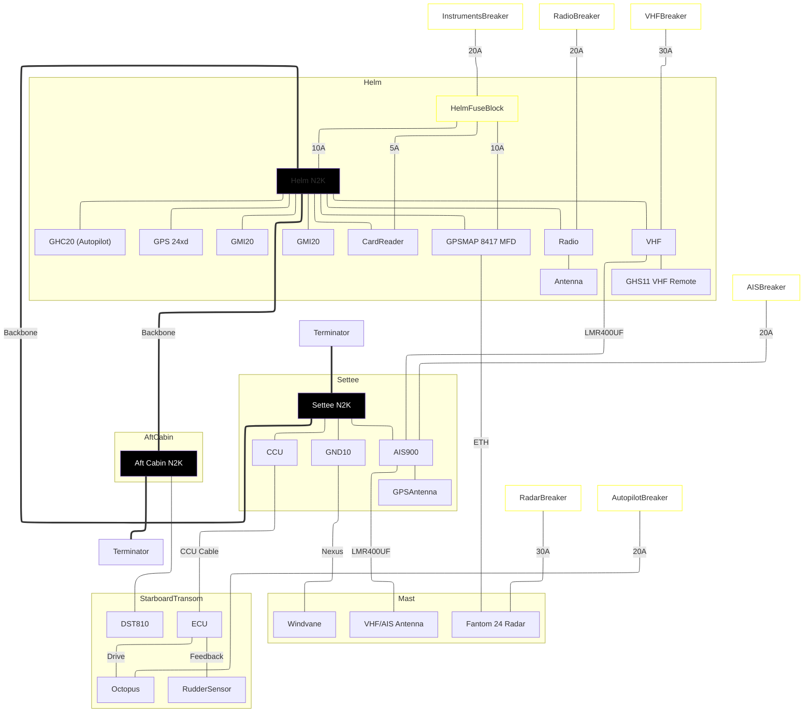

## Garmin

| Specification |  |
| ---- | ---- |
| MMSi |  |
|  |  |

```mermaid

flowchart-elk TB

classDef N2K fill:black
classDef Power stroke:yellow,fill:none

subgraph Mast
    Antenna["VHF/AIS Antenna"]
    Radar["Fantom 24 Radar"]:::Garmin
    Windvane
end

RadarBreaker:::Power ---|30A| Radar

subgraph Helm
	HelmFuseBlock:::Power
	MFD["GPSMAP 8417 MFD"]:::Garmin
	MFD ---|ETH| Radar
	CockpitN2K[Helm N2K]:::N2K
	HelmFuseBlock ---|10A| CockpitN2K
	HelmFuseBlock ---|10A| MFD
	HelmFuseBlock ---|5A| CardReader
	CockpitN2K --- MFD
	CockpitN2K --- GMI201["GMI20"]
	CockpitN2K --- GMI202["GMI20"]
	CockpitN2K --- GHC20["GHC20 (Autopilot)"]
	CockpitN2K --- GPS["GPS 24xd"]
	CockpitN2K --- CardReader
	CockpitN2K --- Radio --- AMFMAntenna["Antenna"]
	CockpitN2K --- VHF
	VHF --- VHFRemote["GHS11 VHF Remote"]
end

InstrumentsBreaker:::Power ---|20A| HelmFuseBlock
RadioBreaker:::Power ---|20A| Radio
VHFBreaker:::Power ---|30A| VHF

subgraph Settee
	SalonN2K[<font color=white>Settee N2K]:::N2K
	SalonN2K --- AIS["AIS900"]
	AIS --- GPSAntenna
	SalonN2K --- GND10:::Garmin ---|Nexus| Windvane
	SalonN2K --- CCU
	VHF ---|LMR400UF| AIS["AIS900"] ---|LMR400UF| Antenna
end

AISBreaker:::Power ---|20A| AIS

subgraph AftCabin
	StarboardN2K[<font color=white>Aft Cabin N2K]:::N2K
end

subgraph StarboardTransom
	CCU ---|CCU Cable| ECU
	ECU ---|Drive| Octopus
	ECU ---|Feedback| RudderSensor
	StarboardN2K --- DST810
end

AutopilotBreaker:::Power ---|20A| Octopus


T1["Terminator"] === SalonN2K ===|Backbone| CockpitN2K ===|Backbone| StarboardN2K === T2["Terminator"]


```

