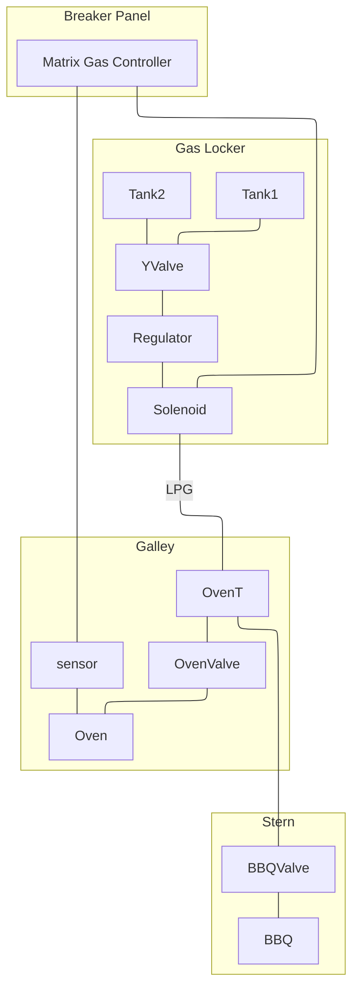

## LPG

### Tanks
There are 2x 10kg composite LPG tanks located in a gas locker in the fore deck. They connect to a manual Y select and shutoff valve which feeds the pressure regulator and solenoid. The solenoid is controlled by a gas controller located in the breaker panel. 
### Gas Controller
A BEP Matrix Gas Controller is located in the breaker panel. It has a gas sensor located beneath the oven. There is a spare sensor in the parts locker. The controller is powered from a breaker labelled "LPG". 
### Oven
Gas is fed from the gas locker to the oven via a sheathed copper line. There is a shutoff valve located beneath the oven. The oven is a Force 10 jetted for propane. An auto igniter unit is mounted underneath. A single AA battery is accessible in the front bottom corner of the oven.
### BBQ
A Tee connects the gas supply line from the oven to a stern mounted grill. A manual shutoff valve for the grill is located in the port transom. The BBQ is a Weber Q1200 jetted for propane. 