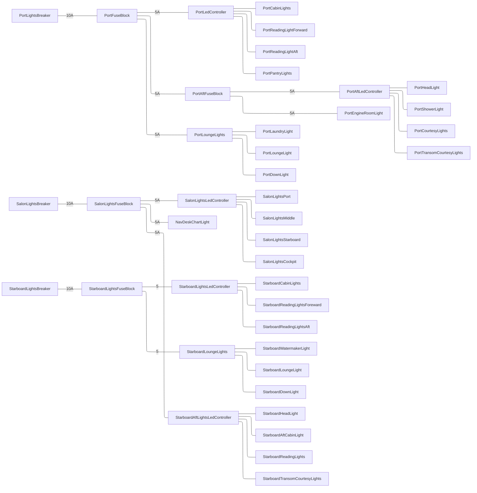
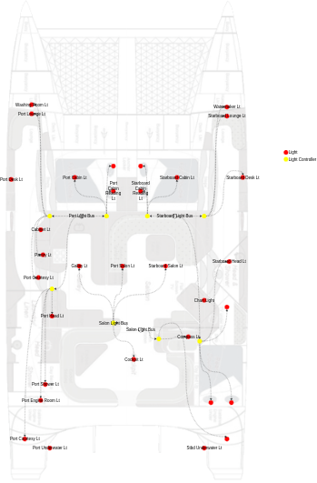

## Lighting
### Navigation Lighting
Navigation lights are hardwired to breakers in the DC distribution panel.  All nav lights are marine grade LED fixtures. 

| Breaker Label | Lights |
|---|---|
| Navigation Lights | Both bow and stern lights |
| Tri Color | Masthead tri color |
| Anchor Light | Masthead anchor light |
| Steaming Light | Mid mast steaming light |
| Deck Light | Mid mast deck light |

Other than the deck light, all navigation lights are Hella 3nm sealed LED lights. The LED bulbs cannot be changed or serviced. The  Hella deck light uses standard H3 type car headlight bulbs and have been retrofitted with high intensity LED fog light bulbs.
### Cabin Lighting
Cabin lights are powered in three zones from distribution panel breakers labeled Port Lights, Salon Lights, and Starboard Lights. Power for each zone is fed to an ATC fuse block then either a locally switched light fixture or an LED controller. There are 4x Shelly RGBW2 LED controllers with 4 circuits each totally 16 light circuits.  They are connected via Wifi to the Victron Cerbo GX. Cabin lights are switched by Zigbee wall switches located near each light.  A Zigbee controller coordinates on/off/dim commands between switches and led controllers.  Lights can also be  controlled via wifi, a web browser, mobile app, or Victron MQTT.

### Cabin Light Locations
 

### Recessed Light Bulbs
Overhead recessed lights are Hella 75mm Euro lights retrofitted with LED bulbs. The bulbs use standard G4 pin bases. Many retrofit bulbs are too long. The length of the bulb needs to be < 24mm from top of the pins to the tip or 32mm LOA.

![[Pasted image 20240117174115.png]]