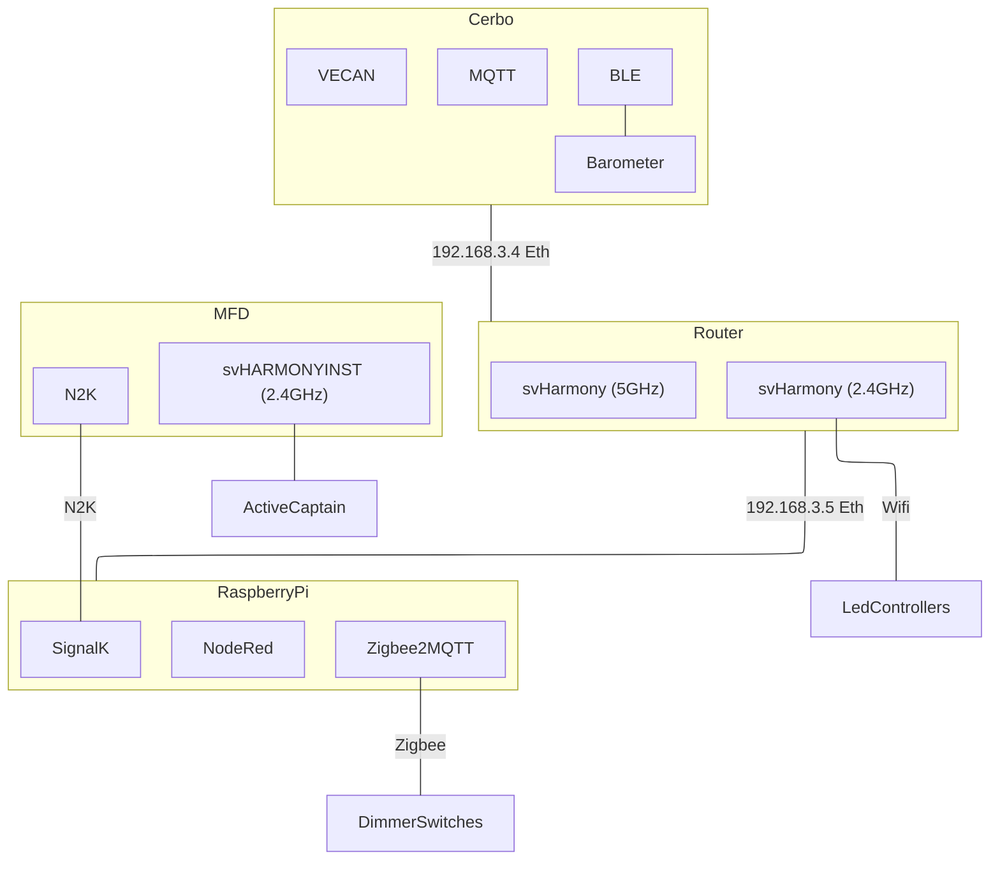

## Network

## DHCP Status Addresses
| Device Name | Manuf | Device ID | IP | MAC | Location |
| ---- | ---- | ---- | ---- | ---- | ---- |
| router | Mikrotik |  | 192.168.3.1 |  | DIN |
| einstien (victron) | Victron |  | 192.168.3.4 | C0:61:9A:B1:12:C5 | Settee, Starboard Side |
| ha | ODroid |  | 192.168.3.5 | 00:1E:06:42:2D:E4 | DIN |
| Port Cabin Lights | Shelly | 285126 (2642214) | 192.168.3.11 | 48:3F:DA:28:51:26 | Settee, Port |
| Port Aft Lights | Shelly | D8BDD2 (14204370) | 192.168.3.12 | 58:BF:25:D8:BD:D2 | Port Engine Room |
| Starboard Cabin Lights | Shelly | 2CC680 (2934400) | 192.168.3.13 | 48:3F:DA:2C:C6:80 | Settee, Starboard Side |
| Starboard Aft Lights | Shelly | D9424F (14238287) | 192.168.3.14 | 58:BF:25:D9:42:4F | Aft Cabin |
| Salon Lights | Shelly | 16E69F (1500831) | 192.168.3.15 | 44:17:93:16:E6:9F | Salon Behind Radio |
|  |  |  |  |  |  |
