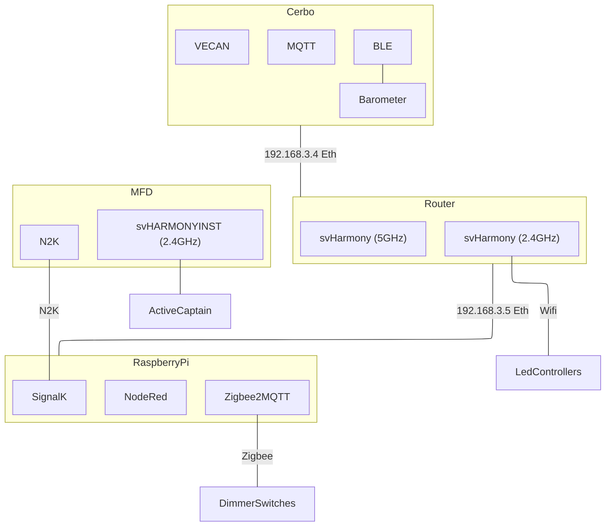

## Network

```mermaid
flowchart-elk

subgraph Router
svHarmony24["svHarmony (2.4GHz)"]
svHarmony["svHarmony (5GHz)"]
end

subgraph Cerbo
	MQTT
	VECAN
	BLE --- Ruuvi["Barometer"]
end
Cerbo ---|192.168.3.4 Eth| Router


subgraph RaspberryPi
	Zigbee2MQTT 
	SignalK
	NodeRed
end
Router ---|192.168.3.5 Eth| RaspberryPi

subgraph MFD
	svHARMONYINSTRUMENTS["svHARMONYINST (2.4GHz)"]
	N2K
end
svHARMONYINSTRUMENTS --- ActiveCaptain
N2K ---|N2K| SignalK

Zigbee2MQTT ---|Zigbee| DimmerSwitches
svHarmony24 ---|Wifi| LedControllers
```
