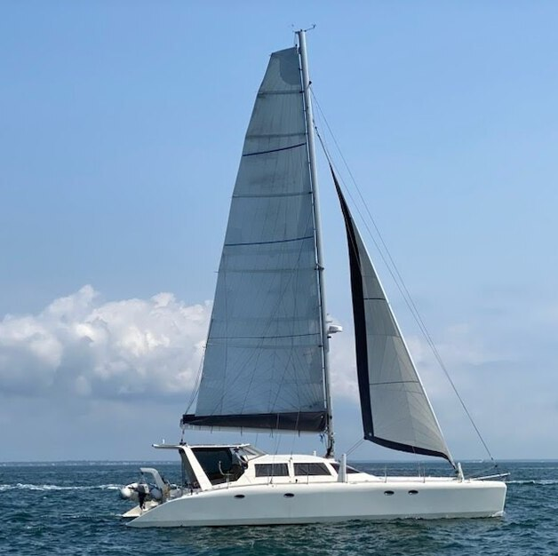

# Harmony Owner's Manual

December 12, 2023

- [Preface](Preface.md)
# Overview
- [Specifications](Specifications.md)
- [Safety](Safety.md)
# Electrical
- [DC](DCSystemOverview.md)
- [Batteries](Batteries.md)
- [Power Distribution](PowerDistribution.md)
- [Engines Start and Charge](EnginesStartAndCharge.md)
- [Garmin](Garmin.md)
- [Victron](Victron.md)
- [Lighting](Lighting.md)
- [Solar](Solar.md)
- [AC](ACSystemOverview.md)
- [Network](Network.md)
# Plumbing
- [Bilge Pumps](BilgePumps.md)
- [Fresh Water](FreshWater.md)
- [Toilets](Toilets.md)
- [LPG](LPG.md)
# Mechanical
- [Engines](Engines.md)
- [Refrigeration](Refrigeration.md)
- [Appliances](Appliances.md)
- [Tender](Tender.md)
# Sails & Rigging
- [Sails](Sails.md)
- [Rigging](Rigging.md)
- [Steering](Steering.md)
- [Winches](Winches.md)
- [Ground Tackle](GroundTackle.md)
# Appendices
- [DIN](DIN.md)
- [Equipment](Equipment.md)
- [Service Schedule](service.md)
- [History](History.md)
