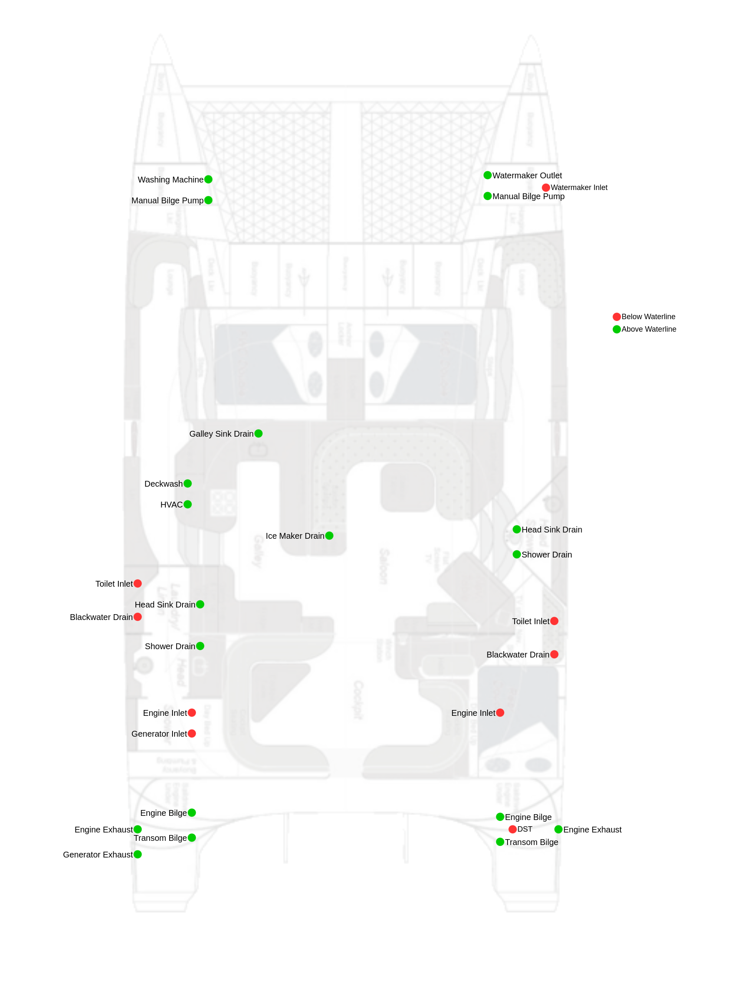

## Safety
### Thru Hulls
Through hulls are reinforced nylon skin fittings and ball valves by TruDesign ^[https://www.trudesign.nz/marine]. Threads are BSPP. Pipe joint compound is Highside Leak Lock^[https://www.jcwhitlam.com/Product/1/124/116#]. All skin fittings have a thickened epoxy ring surrounding the hole to protect the core. Below waterline thru hulls also have G10 reinforcement discs glued to the inner hull and load bearing collars to exceed the ABYC H27 standard. 

### Bouyancy
Each hull has 9 sealed compartments beneath the sole and large crash compartments in the bows to provide positive bouyancy in case of flooding. 
### Safety Equipment
- Fire Extinguishers[^extinguishers]
- Fire Blanket
- First Aid
- Liferaft[^liferaft]
- EPIRB
- Flares & Air Horn
- Iridium GO! SoS
- DSC SoS

[^extinguishers]: 2x in the salon and galley; 1x in each foreward cabin; 2x located in each engine compartment.
[^liferaft]: The liferaft has expired so would need servicing to be useful. It's technically not included in the sale but we'll leave it aboard in case it's wanted. It's a 2019 Viking RescueMe8 in a hard shell.
