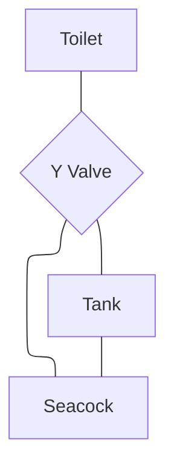

## Toilets
There are 2x Tecma Silence Compact electric macerating toilets, one in each head. They are operated by a 2 button control panel located near the toilet. Push the left button (labelled "Before") to pre fill the bowl with salt water. Push the right button (labelled "After") to flush. 

A Johnson SPX pump pumps salt water into the bowl. It has a removable inlet screen that needs to be cleaned occasionally. A Jabsco Y Valve directs black water either into the holding tank or directly overboard. The holding tanks have a pumpout discharge port and air vent line plumbed through the deck. The tanks can also be gravity discharged overboard via a seacock valve. 
### Discharge Procedure

| Valve Position | Y Valve | Seacock |
|---|---|---|
| Use Holding Tank | Tank (Up) | Closed |
| Empty Tank Overboard | Tank (Up) | Open |
| Flush Toilet Overboard | Overboard (Down) | Open |

Make sure to never leave the Y Valve set to Overboard (Down) with the seacock closed.