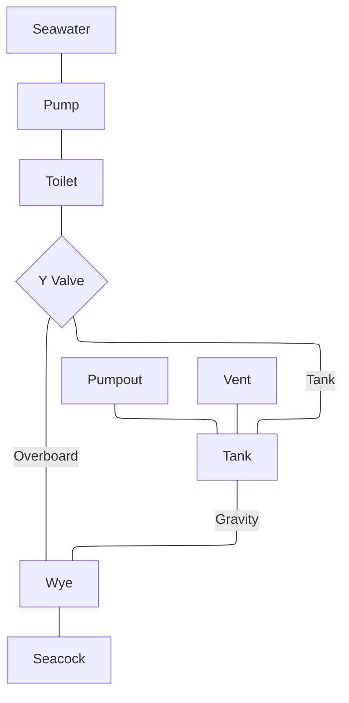
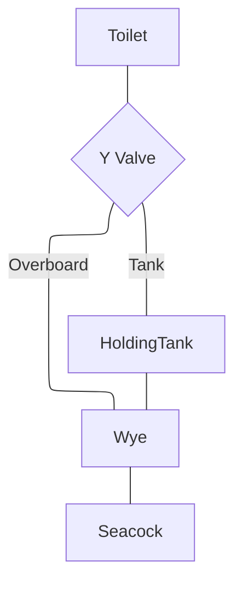

## Toilets
There are 2x Tecma Silence Compact electric macerating toilets, one in each head. They are operated by a 2 button control panel located near the toilet. Push the left button (labelled "Before") to pre fill the bowl with salt water. Push the right button (labelled "After") to flush. 

A Johnson SPX pump pumps salt water into the bowl. It has a removable inlet screen that needs to be cleaned occasionally. A Jabsco Y Valve directs black water either into the holding tank or directly overboard. The holding tanks have a pumpout discharge port and air vent line plumbed through the deck. The tanks can be gravity discharged overboard via a seacock valve. 

### Discharge Procedure

| Valve Position | Y Valve | Seacock |
| ---- | ---- | ---- |
| Use Holding Tank | Tank (Up) | Closed |
| Empty Tank Overboard | Tank (Up) | Open |
| Flush Toilet Overboard | Overboard (Down) | Open |
| Service Only | Overboard (Down) | Closed |

Make sure to never leave the Y Valve set to Overboard (Down) with the seacock closed. Flushing the toilet with the seacock closed will force pressurized waste water into the bottom of the holding tank potentially causing a leak. 
### Annual Service
Flush the waste plumbing and tanks annually to prevent uric scale from clogging the hoses and fittings. Use an acid solution such as Sew Clean^[https://www.trac-online.com/products/descalers/sew-clean]. Close the seacock and fill the system with acid and fresh water by filling the bowl and flushing. After soaking overnight, move the Y valve to "overboard" and flush a few bowlfuls to dislodge scale in the tank gravity feed line. This does put pressurized acidic water into the toilet and tank discharge hoses posing a risk of a leak. 