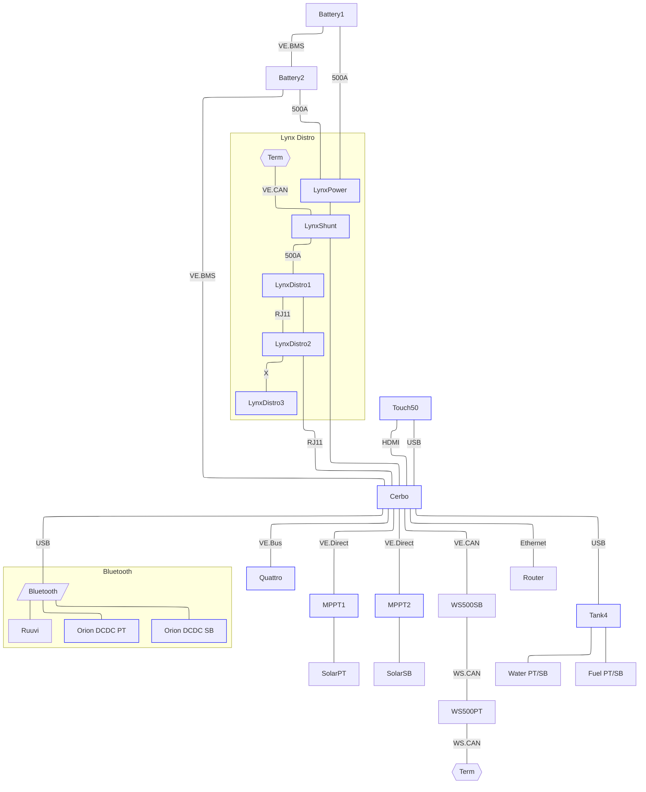

## Victron

```mermaid

flowchart-elk TB

classDef Victron stroke:blue

subgraph Distro["Lynx Distro"]
	LynxPower:::Victron --- LynxShunt:::Victron ---|500A| LynxDistro1:::Victron --- LynxDistro2:::Victron ---|X| LynxDistro3:::Victron
	VECANT1{{"Term"}} ---|VE.CAN| LynxShunt
end
Battery1 ---|500A| LynxPower
Battery2 ---|500A| LynxPower

Battery1 ---|VE.BMS| Battery2 ---|VE.BMS| Cerbo:::Victron
LynxDistro1 ---|RJ11| LynxDistro2 ---|RJ11| Cerbo
Touch50:::Victron ---|HDMI| Cerbo
Touch50:::Victron ---|USB| Cerbo
Cerbo ---|VE.Bus| Quattro:::Victron
Cerbo ---|VE.Direct| MPPT1:::Victron --- SolarPT
Cerbo ---|VE.Direct| MPPT2:::Victron --- SolarSB
Cerbo ---|USB| Bluetooth[/Bluetooth/]
LynxShunt --- Cerbo ---|VE.CAN| WS500SB ---|WS.CAN| WS500PT ---|WS.CAN| VECANT2{{"Term"}}
Cerbo ---|Ethernet| Router
Cerbo ---|USB| Tank4:::Victron
Tank4 --- Water["Water PT/SB"]
Tank4 --- Fuel["Fuel PT/SB"]
subgraph BluetoothNetwork["Bluetooth"]
	Bluetooth --- OrionDCDCPT["Orion DCDC PT"]:::Victron
	Bluetooth --- OrionDCDCSB["Orion DCDC SB"]:::Victron
	Bluetooth --- Ruuvi
end
```
 