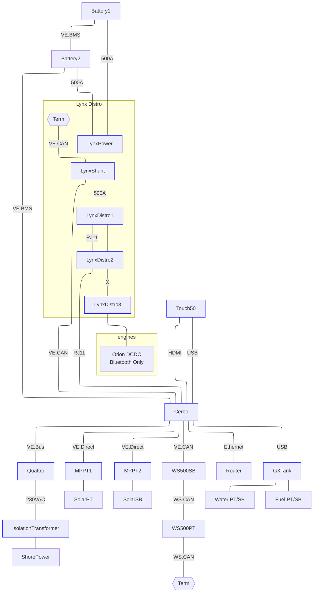

## Victron

 

### Cerbo GX
The Batteries are connected to the Cerbo via VE.BMS. The Cerbo uses DVCC to allow the BMS to control (dis)charge voltage and current. Battery measurements (SoC, SoH, V, I, Temp, etc) are provided by the BMS. The Cerbo can be accessed via the Touch display at the navdesk or a web browser at [victron](victron.home.arpa).

### Lynx Distro
The LynxPower has no monitoring circutry and only serves to combine the high current cables of both batteries. The LynxShunt connects to the Cerbo via VE.CAN. It reports it's measurements but is otherwise disabled. The first 2 LynxDistro units connect to the Cerbo via RJ11 serial cable. 

### Quattro
The Quattro connects to the Cerbo via VE.BUS. Its charge  profile is controlled by the battery BMS via DVCC. 

### MPPT
The MPPT controllers connect to the Cerbo via VE.Direct. Their charge profile is controlled by the BMS via DVCC.

### Isolation Transformer
The isolation transformer is configured to auto sense incoming voltage and convert to 230VAC. It does not convert frequency. All current AC equipment is compatible with 60Hz. In practice, incoming shorepower is increased slightly to account for voltage loss in shore power cabling. When connected to 50A 240VAC service, incoming voltage may be as high as 250VAC. Make sure any new equipment is safe at that voltage and 50/60Hz. It is not connected to the Cerbo.

### MQTT
The Cerbo is configured to publish its info to an MQTT server for integration with SignalK and Home Assistant. More details are under [Network](Network.md). It has a wired ethernet connection to the router for VRM and update access.  

### Wakespeed Regulators
The Wakespeed WS500s report information on the VE.CAN bus but do not follow DVCC. They are configured with independent voltage and current sensors and use a conservative LiFePO4 charge profile. They will slave to each other when both engines are on.

### Orion DCDC Chargers
The Orion DCDC chargers do not integrate with the Cerbo.  Use Victron Connect via Bluetooth to monitor and configure. There is a physical jumper in the bottom of each unit. Pull out the jumper to temporarily disable the Orion.

