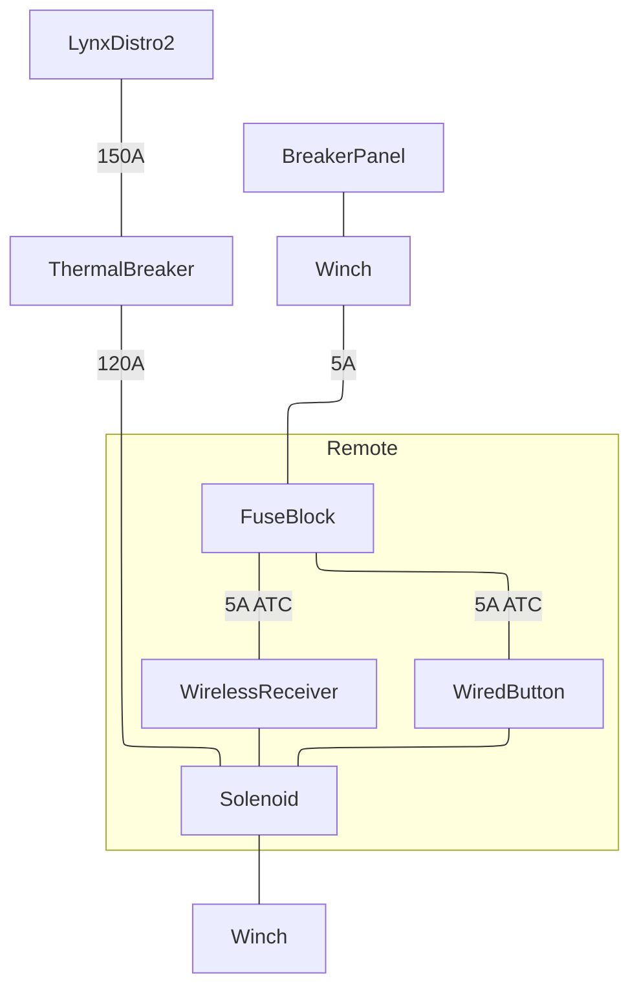

## Winches
There is 1x electric and 3x manual winches. All are 2-speed, chromed, self tailing XT ST cruise series winches by Antal ^[https://www.antal.it/eng/winches_en]. Spares parts are located in the starboard bow lounge locker.

| Winch | Model | Controls |
| --- | --- | --- |
| Main, Electric | XT62EH 2-speed | Main Halyard, Reef Lines, and Topping Lift |
| Starboard Sheet | XT52 | Jib, Main, Spin, and Code sheets |
| Port Sheet | XT52 | Main, Spin, and Code sheets |
| Mast Halyard | XT50 | Jib, Spin, and Code halyards |
### Main Electric Winch
The main electric winch is powered directly from the main power bus behind the Settee. There is a 150A MEGA fuse located in Distro 2 followed by a 120A thermal breaker located above the Lynx Distro boxes. If the winch is overloaded, the thermal breaker should trip before the MEGA fuse protecting the MEGA fuse from blowing. 

The winch is controlled by wired buttons located in the cockpit bulkhead above the winch and a wireless remote located behind the winch underneath the solenoid. Both the wired buttons and wireless remote receiver are fused with 5A ATC fuses in a fuse block located underneath the solenoid. The fuse block receives power from the distibution panel breaker labelled "Winch".

### Main Winch Clutch
A spinlock deck organizer and 5x jam cleat pack is located beneath the main electric winch. They control the Main halyard and reefing lines as well as the topping lift. 

Lines are arranges left to right as follows:

| 1 | 2 | 3 | 4 | 5 |
| --- | --- | --- | --- | --- |
| 3rd Reef | Topping Lift | Main Halyard | 2nd Reef | 1rst Reef |
| Red | Black w/ Yellow Flecks | Black | Blue | Green |

The lines are fed underneath the bridge deck through 2x 90 degree custom turning blocks under the clutches and the mast, and 2x 30 degree Antal organizers accessed from under the bridgedeck. The organizers need occasional cleaning and re coating with tefgel to avoid excessive salt deposits and corrosion. 

